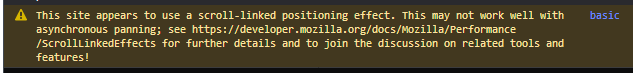

# ngx-scrollbar-indicator
[](https://www.npmjs.com/package/ngx-scrollbar-indicator "npm package")
[](https://travis-ci.com/shhdharmen/ngx-scrollbar-indicator "Travis-CI Build")
[](https://shhdharmen.github.io/ngx-scrollbar-indicator/ "online demo")
[](https://stackblitz.com/edit/ngx-scrollbar-indicator-basic?file=src/app/app.component.html "online demo")
[](https://github.com/shhdharmen/ngx-scrollbar-indicator/blob/master/LICENSE "MIT License")

Consider a scenario, where you have 100s of items, sorted alphabetically. Now, when user scrolls through the same, user doesn't know easily which character he/she has arrived, this is where ngx-scrollbar-indicator comes in picture. This will add an indicator to scrollbar, which will show first character of the item in view port.
___

## Table of Contents

  - [What it does?](#what-it-does)
    - [Description](#description)
  - [Examples](#examples)
  - [Installation](#installation)
  - [Usage](#usage)
  - [API](#api)
    - [Options *ScrollbarIndicatorOptions*](#options-scrollbarindicatoroptions)
    - [Properties](#properties)
    - [Methods](#methods)
    - [Observers](#observers)
  - [Styling](#styling)
  - [Development](#development)
  - [Issues](#issues)
  - [Author](#author)
  - [Credit](#credit)
  - [ToDos](#todos)
  - [Badges](#badges)

___

<a name="what-it-does"/>

## What it does?

### Description

- Consider a scenario, where you have 100s of items, sorted alphabetically. Now, when user scrolls through the same, user doesn't know easily which character he/she has arrived, this is where ngx-scrollbar-indicator comes in picture. This will add an indicator to scrollbar, which will show first character of the item in view port. See screenshot below:


<a name="examples"/>

## Examples

- Stackblitz [Basic](https://stackblitz.com/edit/ngx-scrollbar-indicator-basic?file=src/app/app.component.html), [Styling](https://stackblitz.com/edit/ngx-scrollbar-indicator-style?file=src%2Fstyles.scss)
- Github Pages [Basic](https://shhdharmen.github.io/ngx-scrollbar-indicator/basic), [Bootstrap](https://shhdharmen.github.io/ngx-scrollbar-indicator/bootstrap)

<a name="installation"/>

## Installation

**NPM**
```bash
npm i ngx-scrollbar-indicator
```
<a name="usage"/>

## Usage

1.  Import `NgxScrollbarIndicatorModule` in your module
```js
...
import { NgxScrollbarIndicatorModule } from 'ngx-scrollbar-indicator';
...
@NgModule({
  ...
  imports: [
    BrowserModule,
    ...,
    NgxScrollbarIndicatorModule
  ]
})
...
```

2.  import in style.scss
```scss
@import "~ngx-scrollbar-indicator/assets/theme.scss";
```

3.  In your template, wrap you element, in which you want indicator, like below :
```html
<ngx-scrollbar-indicator #indicatorRef>
  <!-- Your element with *ngFor goes here. Do not forget to add attribute 'indicatorItem', which takes string from which first character will be visible in indicator. -->
</ngx-scrollbar-indicator>
```

<a name="api"/>

## API

- API consists of Options, Properties, Methods and Observers.

<a name="options">

### Options *[ScrollbarIndicatorOptions](https://github.com/shhdharmen/ngx-scrollbar-indicator/blob/master/projects/ngx-scrollbar-indicator/src/lib/interface/scrollbar-indicator-options.ts)*
- You can give options according to you need and modify the behavior. All options are optional. Below is full list of options :

| Option          | Type                                   | Description                                                                                                                                                          |
| --------------- | -------------------------------------- | -------------------------------------------------------------------------------------------------------------------------------------------------------------------- |
| enable          | boolean                                | Enable or disable indicator. *Default : true*                                                                                                                        |
| changeWhen      | EChangeWhen (top/visible)              | When the indicator should change the character? When character has reach top of container or as soon as it becomes visible in container. *Default : EChangeWhen.top* |
| containerHeight | number                                 | height of the container, without this, scrolling won't work. *Default : 500*                                                                                         |
| theme           | ETheme (circular/waterDrop/squareLike) | Visual theme of indicator, totally based on scss. *Default : ETheme.waterDrop*                                                                                       |
| position        | EPosition (auto/top)                   | Position of indicator, whether to show on top or auto. *Default : EPosition.auto*                                                                                    |
| showWhen        | EShowWhen (always/scroll)              | When to show the indicator, always or onscroll/onhover. *Default : EShowWhen.scroll*                                                                                 |

<a name="properties">

### Properties

| Name   | Type                                             | Description                                           |
| ------ | ------------------------------------------------ | ----------------------------------------------------- |
| all    | [ScrollbarIndicatorItemDirective](https://github.com/shhdharmen/ngx-scrollbar-indicator/blob/master/projects/ngx-scrollbar-indicator/src/lib/directive/scrollbar-indicator-item.directive.ts)[]                | All Items Array                                       |
| firsts | { [x: string]: ScrollbarIndicatorItemDirective } | JSON Object with first item of each character         |
| lasts  | { [x: string]: ScrollbarIndicatorItemDirective } | JSON Object with last item of each character          |
| view   | HTMLElement                                      | Viewport Element, on which scrolling event is handled |

<a name="methods">

### Methods

| Name          | Parameters                                                                                                                              | Returns                                                                             | Description                                                                                                                                                                                                                                     |
| ------------- | --------------------------------------------------------------------------------------------------------------------------------------- | ----------------------------------------------------------------------------------- | ----------------------------------------------------------------------------------------------------------------------------------------------------------------------------------------------------------------------------------------------- |
| showIndicator | - timer, this will help to maintain frequent calls to this function<br> - duration (default 500), after which indicator will be hidden  | Timer, which can be cleared if you are calling this function again within duration. | Ideally, you shouldn't call this. This will show the indicator. This will add 'show' class to the indicator. And After duration(default 500), if will remove the same. Calling this won't make any sense if showWhen is set to EShowWhen.always |
| goToLetter    | - letter, Character to which viewport should be scrolled<br>- position (default 'first') Element of that character group, first or last | offsetTop of element or -1 if error                                                 | Scroll to a specific letter, positioned first of last. Returns the offsetTop if element found, else -1. Works only in Non-IE Browsers.  |
| goToLetterIE    | - letter, Character to which viewport should be scrolled<br>- position (default 'first') Element of that character group, first or last | offsetTop of element or -1 if error                                                 | Scroll to a specific letter, positioned first of last. Returns the offsetTop if element found, else -1. Works only in IE Browsers.  |
| startCalculation  | none  | void | Call this only if you are changing options in the run-time. This will calculate arrays and characters, based on options. This is called once after ngAfterContentInit hook.  |

<a name="observers">

### Observers

| Name                     | Type               | Description                                      |
| ------------------------ | ------------------ | ------------------------------------------------ |
| currentCharacterObserver | Observable<string> | Stream that emits current character in indicator |

<a name="styling">

## Styling
Once you have imported `theme.scss` in `style.scss`, you will hae access to some variables. Be cautios while changing the same:
```scss
$indicator-background-color: #2196f3 !default;
$indicator-background-size: 46px !default;
$bubble-font-size: 16px !default;
$bubble-font-weight: 400 !default;
$indicator-font-color: #fff !default;
$indicator-margin-right: 8px !default;
$indicator-container-right: 105% !default;
$indicator-right: 105% !default;
$indicator-square-like-border-radius: 4px !default;
```
- You can find the styling example on [stackblitz](https://stackblitz.com/edit/ngx-scrollbar-indicator-style?file=src%2Fstyles.scss).

<a name="development"/>

## Development

- This project uses the Angular CLI for building the library.

```bash
$ ng build ngx-scrollbar-indicator
```

or

```bash
$ npm run build_lib
```

<a name="issues"/>

## Issues

- If you identify any errors in the library, or have an idea for an improvement, please open an [issue](https://github.com/shhdharmen/ngx-scrollbar-indicator/issues).

<a name="author"/>

## Author

- Dharmen Shah [Github](https://github.com/shhdharmen), [Twitter](https://twitter.com/shhdharmen)

<a name="credit"/>

## Credit

I would like to give few credits, as this is my first Angular Library.

- Thanks
  - [Todd Palmer](https://twitter.com/toddtpalmer) for great series at [medium](https://blog.angularindepth.com/creating-a-library-in-angular-6-87799552e7e5)
  - [ng packagr](https://github.com/ng-packagr/ng-packagr) for simplifying creating, packaging and publishing Angular Library process
- Inspiration : Contacts app in Android.

<a name="to-dos"/>

## ToDos
- Get rid of browser console error regarding scrolling



- Use [@angular/cdk](https://material.angular.io/cdk/categories)
- Use [](https://github.com/semantic-release/semantic-release)
- Compatibilities with dates, like a time line
- Show custom number of characters in indicator
- Add example with [Angular Material](https://material.angular.io/)
- Add more examples with bootstrap

<a name="badges">

## Badges

[](https://www.npmjs.com/package/ngx-scrollbar-indicator "npm package")
[](https://travis-ci.com/shhdharmen/ngx-scrollbar-indicator "Travis-CI Build")
[](https://codecov.io/gh/shhdharmen/ngx-scrollbar-indicator)
[](https://shhdharmen.github.io/ngx-scrollbar-indicator/ "online demo")
[](https://stackblitz.com/edit/ngx-scrollbar-indicator-basic?file=src/app/app.component.html "online demo")

[](https://github.com/shhdharmen/ngx-scrollbar-indicator/blob/master/LICENSE "MIT License")
[](https://npms.io/search?q=ngx-scrollbar-indicator "NPMS Score")
[](https://www.npmjs.com/package/ngx-scrollbar-indicator#dependencies "Dependencies")